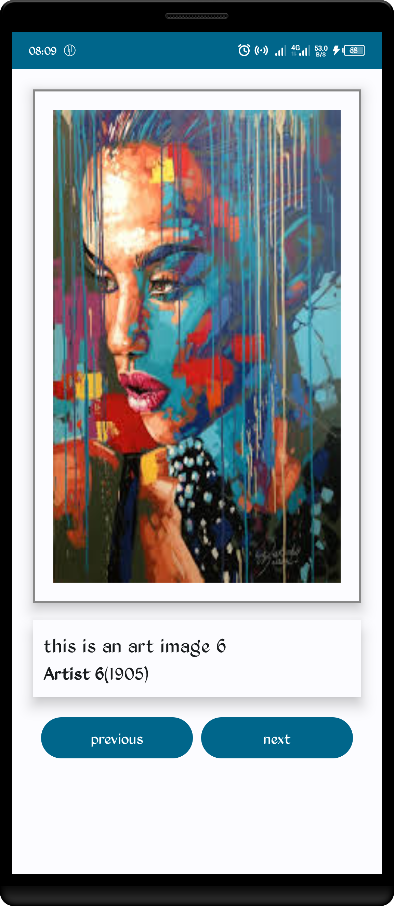
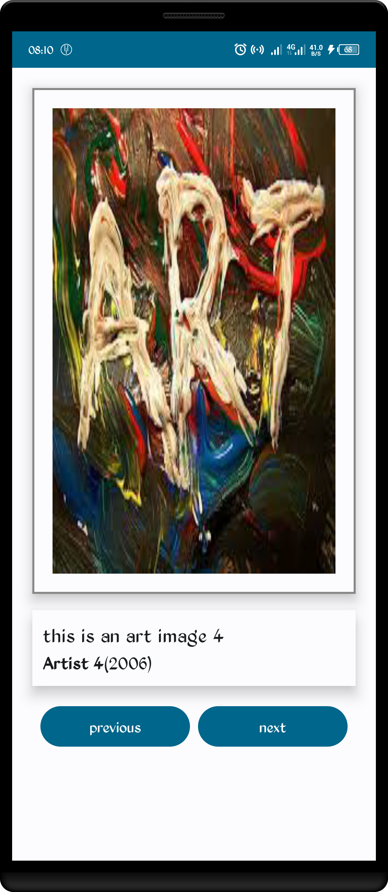

  <h1>Art Space</h1>
  <h3>A sample of an Art Space app that displays a curated collection of framed artwork - by the Android Basics Training team - Android basics Compose</h3>
  
  
  

  Developed with ❤︎ by
  <h4><a href="https://github.com/isaacjadrey">Isaac Jadrey Ongwara Jr</a> in Kotlin & Jetpack Compose</h4>
  
  
   <h4>This is my version of the project app</h4>
   
   <h4>For get the project logic and description, head to:</h4> 
   
   https://developer.android.com/codelabs/basic-android-kotlin-compose-art-space

<h1>Screen Demo:</h1>
<table>
<tr>
<td>Sample Screen 1</td>
<td>Sample Screen 2</td>
</tr>
<tr>
<td></td>
<td></td>
</tr>
</table>

